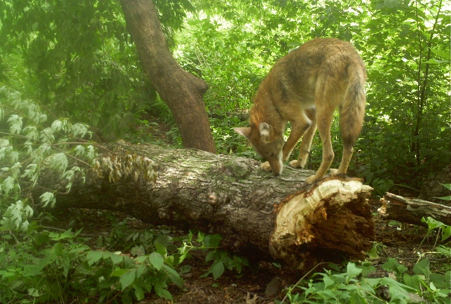
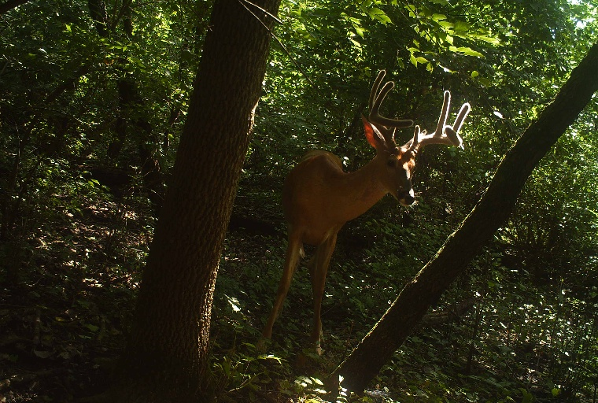
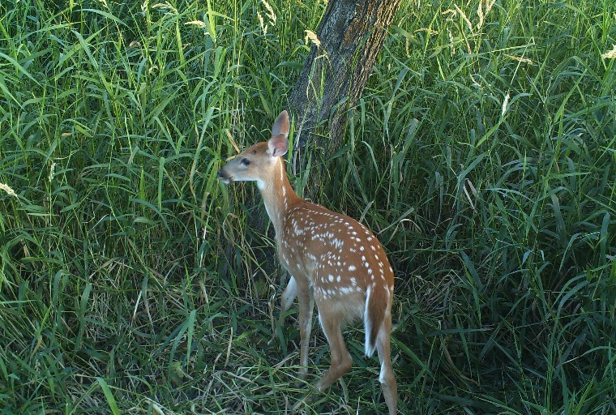
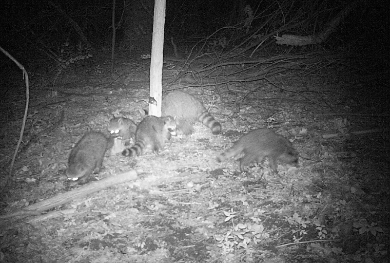

[](https://travis-ci.org/uptake/autofocus)

# Autofocus



This project uses deep learning computer vision to label images taken by motion-activated "camera traps" according to the animals they contain. Accurate models for this labeling task can address a major bottleneck for wildlife conservation efforts.

## Further Reading

- [Uptake.org Autofocus Case Study](https://www.uptake.org/impact/special-projects)
- [Machine Learning Meets Wildlife Conservation](https://www.lpzoo.org/blog/machine-learning-meets-wildlife-conservation)

## Getting the App

If you just want to get labels for your images, you can use the following steps to run a service that passes images through a trained model.

1. Make sure [Docker](https://www.docker.com/get-started) is installed and running.
2. Run `docker pull gsganden/autofocus_serve` to download the app image. (Note that it takes up about 4GB of disk space.)
3. Run `docker run -p 8000:8000 gsganden/autofocus_serve` to start the app.
4. Make POST requests against the app to get predictions. For instance, with the base of this repo as the working directory you can send the image `fawn.jpeg` to the app with `curl -F "file=@./gallery/fawn.jpeg" -X POST http://0.0.0.0:8000/predict`. Or you can create a zip file of the `gallery` directory and send it to the app with `curl -F "file=@gallery.zip" -X POST http://0.0.0.0:8000/predict_zip`. See `autofocus/predict/example_post.py` or `autofocus/predict/example_post.R` for example scripts that make requests using Python and R, respectively.

For a single image, the app will respond with a JSON object that indicates the model's probability that the image contains an animal in each of the categories that it has been trained on. For instance, it might give the following response for an image containing raccoons:

```json
{
  "beaver": 7.996849172335282e-16,
  "bird": 6.235780460883689e-07,
  "cat": 9.127776934292342e-07,
  "chipmunk": 4.231552441780195e-09,
  "coyote": 2.1184381694183685e-05,
  "deer": 3.6601684314518934e-06,
  "dog": 1.4745426142326323e-06,
  "empty": 0.0026697132270783186,
  "fox": 2.7905798602890358e-14,
  "human": 1.064212392520858e-05,
  "mink": 2.7622977689933936e-13,
  "mouse": 4.847318102463305e-09,
  "muskrat": 6.164089044252078e-16,
  "opossum": 9.763967682374641e-05,
  "rabbit": 2.873173616535496e-05,
  "raccoon": 0.9986177682876587,
  "rat": 4.3888848111350853e-10,
  "skunk": 4.078452775502228e-07,
  "squirrel": 1.2888597211713204e-06,
  "unknown": 0.0004612557531800121,
  "woodchuck": 1.2980818033154779e-14
}
```

The `predict_zip` endpoint returns a JSON object mapping file paths to model probabilities formatted as above.

## Getting the Model

The app described above uses a multilabel fast.ai model. You can download that model directly with the following command. This command was written to run from the repo root. 

```bash
aws s3 cp s3://autofocus/models/multilabel_model_20190407.pkl $(pwd)/autofocus/predict/models
```

`autofocus/train_model/train_multilabel_model.ipynb` contains the code that was used to train and evaluate this model.

## Getting the Data

The model described above was trained on a set of images provided by the Lincoln Park Zoo's Urban Wildlife Institute that were taken in the Chicago area in mid-summer 2016 and 2017. If you wish to train your own model, you can use the instructions below to download that dataset and other related datasets.

If necessary, create an AWS account, install the AWS CLI tool (`pip install awscli`), and set up your AWS config and credentials (`aws configure`). All of the commands below are written to run from the repo root.

Use this commend to download a preprocessed version of the Lincoln Park Zoo 2016-2017 dataset to `autofocus/data/` (you can change the destination directory if you like):

```bash
FILENAME=lpz_2016_2017_processed.tar.gz
aws s3 cp s3://autofocus/lpz_data/${FILENAME} $(pwd)/data/
```

Unpack the tarfile:

```bash
mkdir $(pwd)/data/lpz_2016_2017/
tar -xvf $(pwd)/data/${FILENAME} -C $(pwd)/data/lpz_2016_2017/
```

Delete the tarfile:

```bash
rm $(pwd)/data/${FILENAME}
```

This dataset contains approximately 80,000 images and a CSV of labels and image metadata. It occupies 17.1GB uncompressed, so you will need about 40GB free for the downloading and untarring process. The images have been preprocessed by trimming the bottom 198 pixels (which often contains a metadata footer that could only mislead a machine learning model) and resizing to be 512 pixels along their shorter dimension. In addition, the labels have been cleaned up and organized.

If you would like to work with data that has not been preprocessed as described above, replace `FILENAME=lpz_2016_2017_processed.tar.gz` with `FILENAME=data_2016_2017.tar.gz`. You will need to have about 100GB free to download and untar the raw data. `autofocus/build_dataset/lpz_2016_2017/process_raw.py` contains the code that was used to generate the processed data from the raw data.

A second dataset from the Lincoln Park Zoo's Urban Wildlife Institute contains approximately 75,000 images (227 x 227 pixels) and a CSV of labels and image metadata from the Chicago area in 2012-2014. It takes up 7.9GB uncompressed. To get this data, follow the same steps as for the 2016-2017 dataset, but replace `FILENAME=lpz_2016_2017_processed.tar.gz` with `FILENAME=lpz_2012-2014.tar.gz`, and use this command to unpack the tarfile.

```bash
tar -xvf $(pwd)/data/${FILENAME} -C $(pwd)/data/
```

A third dataset from the Lincoln Park Zoo's Urban Wildlife Institute contains unlabeled three-image bursts from 2018. It takes up 5.7GB uncompressed. To get this data, follow the same steps as for the 2012-2014 dataset, but replace `FILENAME=lpz_2016_2017_processed.tar.gz` with `FILENAME=lpz_2018.tar.gz`.

## Example Images






